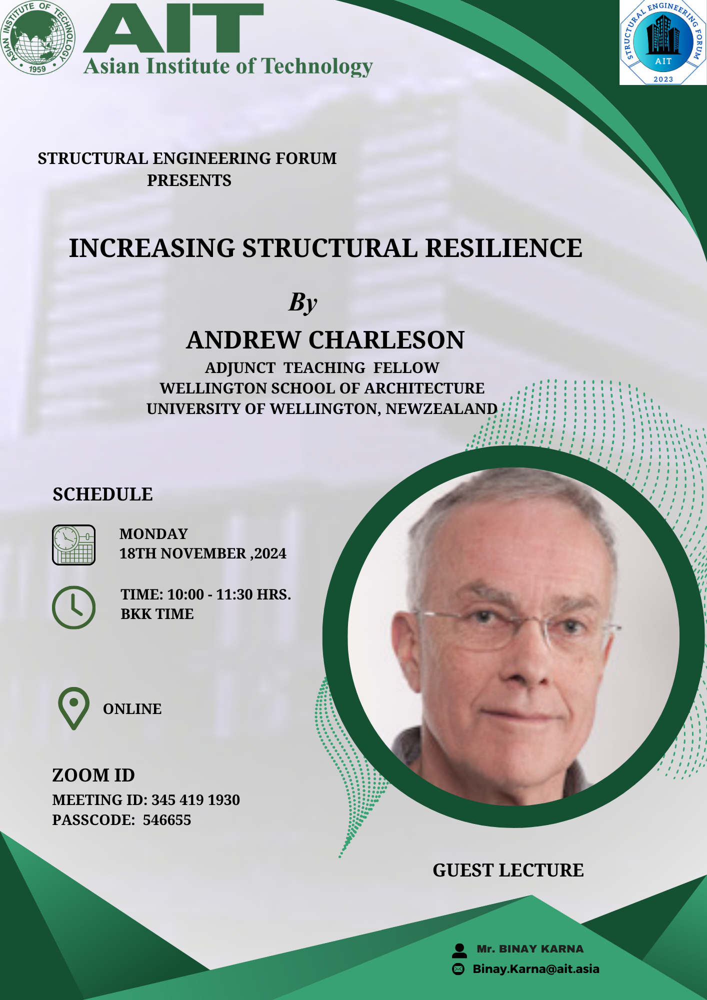

We are excited to announce that we will be having an online lecture by <em>Professor Andrew Charleson</em> on <em>Incresing Structural Resilience</em> on 18th November 2024 from 10.00 AM to 11.30AM BKK time. Prof Charleson is a former Associate Professor at the School of Architecture, Victoria University of Wellington. He retired in December 2017 and is currently a volunteer visiting Professor in schools of architecture, mainly in developing countries. His intereset is earthquake engineering and his research examines how structure can integrate with it.  

---
